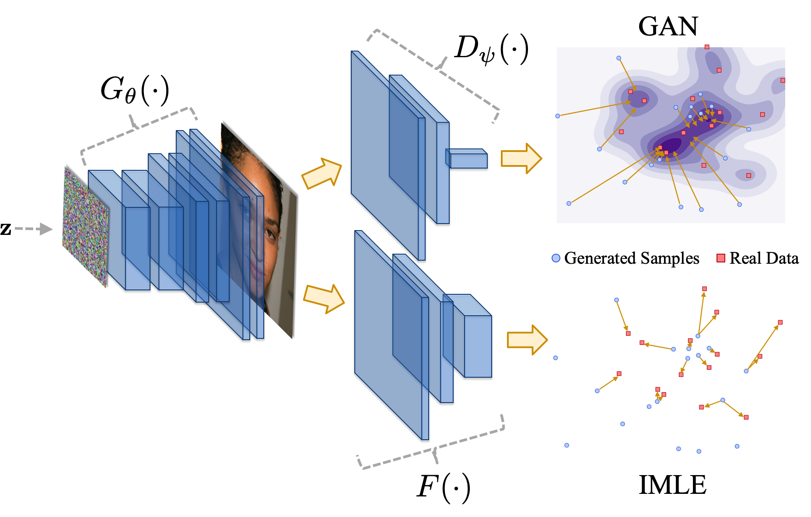

# InclusiveGAN

### [Inclusive GAN: Improving Data and Minority Coverage in Generative Models](https://arxiv.org/pdf/2004.03355.pdf)
[Ning Yu](https://sites.google.com/site/ningy1991/), [Ke Li](https://www.math.ias.edu/~ke.li/), [Peng Zhou](https://pengzhou1108.github.io/), [Jitendra Malik](http://people.eecs.berkeley.edu/~malik/), [Larry Davis](http://users.umiacs.umd.edu/~lsd/), [Mario Fritz](https://cispa.saarland/group/fritz/)<br>
ECCV 2020
### [paper](https://arxiv.org/pdf/2004.03355.pdf) | [video (short)](https://www.youtube.com/watch?v=JbHWuLsn_zg) | [video (full)](https://www.youtube.com/watch?v=oCb4cpsQ7do&t=8s) | [media coverage in Chinese](https://mp.weixin.qq.com/s/6CCWQY8d0NoHEuMqWEp2dw)

<p align="center"></p>


- Official Tensorflow implementation for our [ECCV'20 paper](https://arxiv.org/pdf/2004.03355.pdf) on improving mode coverage and minority inclusion of GANs. We combine [StyleGAN2](https://github.com/NVlabs/stylegan2) and [IMLE](https://www.math.ias.edu/~ke.li/projects/imle/) objectives to get the best of both worlds.<br>
- Contact: Ning Yu (ningyu AT mpi-inf DOT mpg DOT de)

## Image reconstruction


## Interpolation from majority to minority
The 1st column: A majority real image for the beginning frame to reconstruct<br>
The 2nd column: StyleGAN2<br>
The 3rd column: Ours general<br>
The 4th column: Ours minority inclusion<br>
The 5th column: A minority real image for the end frame to reconstruct<br>

- *Eyeglasses*
<pre>Majority real    StyleGAN2     Ours general   Ours minority   Minority real</pre>


- *Bald*
<pre>Majority real    StyleGAN2     Ours general   Ours minority   Minority real</pre>


- *Narrow_Eyes*&*Heavy_Makeup*
<pre>Majority real    StyleGAN2     Ours general   Ours minority   Minority real</pre>


- *Bags_Under_Eyes*&*High_Cheekbones*&*Attractive*
<pre>Majority real    StyleGAN2     Ours general   Ours minority   Minority real</pre>


## Abstract
Generative Adversarial Networks (GANs) have brought about rapid progress towards generating photorealistic images. Yet the equitable allocation of their modeling capacity among subgroups has received less attention, which could lead to potential biases against underrepresented minorities if left uncontrolled. In this work, we first formalize the problem of minority inclusion as one of data coverage, and then propose to improve data coverage by harmonizing adversarial training with reconstructive generation. The experiments show that our method outperforms the existing state-of-the-art methods in terms of data coverage on both seen and unseen data. We develop an extension that allows explicit control over the minority subgroups that the model should ensure to include, and validate its effectiveness at little compromise from the overall performance on the entire dataset.

## Prerequisites
- Linux
- NVIDIA GPU + CUDA 10.0 + CuDNN 7.5
- Python 3.6
- tensorflow-gpu 1.14
- [DCI](https://www.math.ias.edu/~ke.li/projects/dci/) for fast kNN search. Follow the instructions in `dci_code/Makefile` to specify paths to BLAS, Python, NumPy in the file, and build the DCI Python interface.

## Datasets
We experiment on two datasets:
- Preliminary study on **Stacked MNIST** dataset. We synthesize 240k images by stacking the RGB channels with random MNIST images, resulting in 1,000 discrete modes (10 digit modes for each of the 3 channels). We zero-pad the image from size 28x28 to size 32x32. To prepare the dataset, first download the [MNIST .gz files](http://yann.lecun.com/exdb/mnist/) to `mnist/`, then run
  ```
  python3 dataset_tool.py create_mnistrgb \
  datasets/stacked_mnist_240k/ \
  mnist/ \
  --num_images 240000
  ```
  where `datasets/stacked_mnist_240k/` is the output directory containing the prepared data format that enables efficient streaming for our training.
- Main study including minority inclusion on **CelebA** dataset. We use the first 30k images and crop them centered at (x,y) = (89,121) with size 128x128. To prepare the dataset, first download and unzip the [CelebA aligned png images](https://drive.google.com/open?id=0B7EVK8r0v71pWEZsZE9oNnFzTm8) to `celeba/Img/`, then run
  ```
  python3 dataset_tool.py create_celeba \
  datasets/celeba_align_png_cropped_30k/ \
  celeba/Img/img_align_celeba_png/ \
  --num_images 30000
  ```
  where `datasets/celeba_align_png_cropped_30k/` is the output directory containing the prepared data format that enables efficient streaming for our training, and `celeba/Img/img_align_celeba_png/` is the input directory containing CelebA png files.

## Training
- For **Stacked MNIST**, run, e.g.,
  ```
  python3 run_training.py --data-dir=datasets --config=config-e-Gskip-Dresnet --num-gpus=2 \
  --metrics=mode_counts_24k,KL24k \
  --dataset=stacked_mnist_240k \
  --result-dir=results/stacked_mnist_240k \
  --data-size=240000
  ```
  where
  - `metrics`: Evaluation metric(s). `mode_counts_24k` counts for the digit modes (max 1,000) of 24k randomly generated samples. `KL24k` measures their KL divergence to the uniform distribution. The evaluation results are saved in `results/stacked_mnist_240k/metric-mode_counts_24k.txt` and `results/stacked_mnist_240k/metric-KL24k.txt` respectively.
  - `result-dir` also contains real samples `arb-reals.png`, randomly generated samples at different snapshots `arb-fakes-*.png`, real samples for IMLE reconstruction `rec-reals.png`, generated samples at different snapshots for those reconstructions `rec-fakes-*.png`, log file `log.txt`, tensorboard plots `events.out.tfevents.*`, and so on.
- For **CelebA**, run, e.g.,
  ```
  python3 run_training.py --data-dir=datasets --config=config-e-Gskip-Dresnet --num-gpus=2 \
  --metrics=fid30k \
  --dataset=celeba_align_png_cropped_30k \
  --result-dir=results/celeba_align_png_cropped_30k \
  --data-size=30000 \
  --attr-interesting=Bags_Under_Eyes,High_Cheekbones,Attractive
  ```
  where
  - `metrics`: Evaluation metric(s). `fid30k` measures the Fréchet inception distance between 30k randomly generated samples and 30k (entire) real samples. The evaluation result is save in `results/stacked_mnist_240k/metric-fid30k.txt`.
  - `attr-interesting`: The interesting CelebA attribute(s) (separated by comma without space) of a minority subgroup. The list of attributes refer to `celeba/Anno/list_attr_celeba.txt`. **If this argument is omitted, the entire dataset is considered to be reconstructed by IMLE.**
  
## Pre-trained models
- The pre-trained Inclusive GAN models can be downloaded from:
  - [Stacked MNIST 240k](https://drive.google.com/file/d/1K8gPgaUcAfukR7tQjPHQXwI52AErgr9-/view?usp=sharing)
  - [CelebA 30k](https://drive.google.com/file/d/1C8j0nTmoWFMI3O8l5-xpXz4DT_Ha3sI0/view?usp=sharing)
  - [CelebA 30k Eyeglasses inclusion](https://drive.google.com/file/d/1AMIUKiPoibdwCruEGAVtXmNCvuIhPOBR/view?usp=sharing)
  - [CelebA 30k Bald inclusion](https://drive.google.com/file/d/11dvlFb2Z87eMdxJmML3vWJzkripuYBZA/view?usp=sharing)
  - [CelebA 30k Narrow_Eyes,Heavy_Makeup inclusion](https://drive.google.com/file/d/1B94OFdbyMzBL3oKA_o-waj3ytDGL3P8G/view?usp=sharing)
  - [CelebA 30k Bags_Under_Eyes,High_Cheekbones,Attractive inclusion](https://drive.google.com/file/d/13nmgYX4PXix_2Du9v4DaZdco78QR-vT5/view?usp=sharing)
  - Unzip and put under `models/`.

## Evaluation
- **Image generation**. Run, e.g.,
  ```
  python3 run_generator.py generate-images \
  --network=models/celeba_align_png_cropped_30k.pkl \
  --result-dir=generation/celeba_align_png_cropped_30k \
  --num-images=30000
  ```
  where `result-dir` contains generated samples in png.
  
- **Precision and Recall calculation**. Clone [this repository](https://github.com/msmsajjadi/precision-recall-distributions) as `precision-recall-distributions/` and install its dependencies accordingly. Then run, e.g.,
  ```
  python3 precision-recall-distributions/prd_from_image_folders.py \
  --reference_dir=celeba/Img/img_align_celeba_png_cropped_30k \
  --eval_dirs=generation/celeba_align_png_cropped_30k/00000-generate-images \
  --eval_labels test_model
  ```
  where
  - `reference_dir`: The directory containing reference real images in png. **For original CelebA aligned images, they need to be center-cropped at (x,y) = (89,121) with size 128x128 in advance.**
  - `eval_dirs`: The directory(ies) containing generated images in png for precision and recall calculation. It allows multiple inputs, each corresponding to one source of generation.
  - `eval_labels`: The label(s) of the source(s) of generation.
